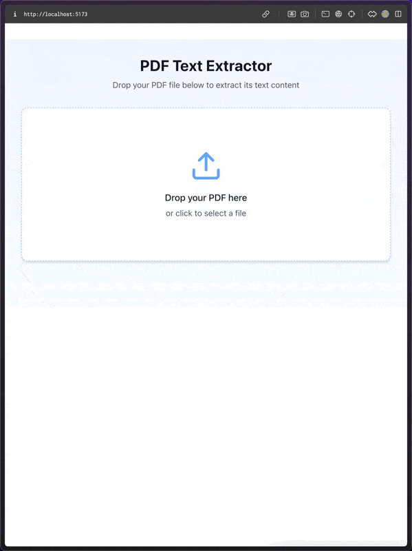

# PDF Text Extractor

A React application for extracting text content from PDF files. Simply drag and drop a PDF file onto the interface, and the app will extract and display its text content in a user-friendly format.

## Features

- Drag-and-drop interface for uploading PDF files.
- Displays extracted text content in an organized format.
- Shows real-time progress as the PDF is processed.
- Supports multiple pages and handles large PDF files efficiently.
- Highlights extracted text length.

## Demo



## Getting Started

Follow these instructions to set up and run the project locally.

### Prerequisites

- Node.js (v14 or higher)
- npm or yarn
- PDF.js library (included in the project)

### Installation

1. Clone the repository:

   ```bash
   git clone https://github.com/your-username/pdf-text-extractor.git
   cd pdf-text-extractor
   ```

2. Install the dependencies:

   ```bash
   npm install
   ```

3. Run the development server

   ```bash
   npm run dev
   ```

### Usage

1. Drag and drop a PDF file onto the drop zone, or click to upload a file.
2. The app will process the file and extract its text content.
3. View the extracted text in the display area.

### Technologies Used

- React: For building the user interface.
- PDF.js: For parsing and processing PDF files.
- Tailwind CSS: For styling.
- Lucide Icons: For modern and clean icons.

### Contributions

Contributions, issues, and feature requests are welcome! Feel free to check the issues page.

### License

This project is licensed under the MIT License.

### Acknowledgments

- PDF.js for handling PDF file parsing.
- Tailwind CSS for the utility-first CSS framework.
- Lucide for the icons.
